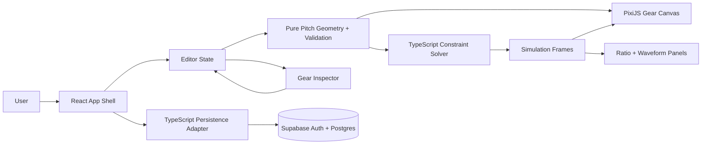
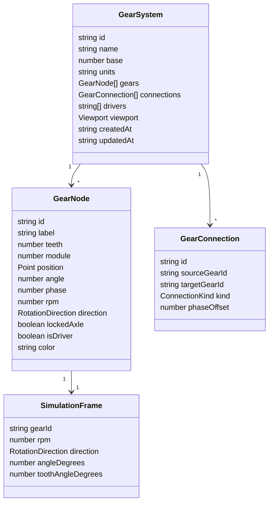
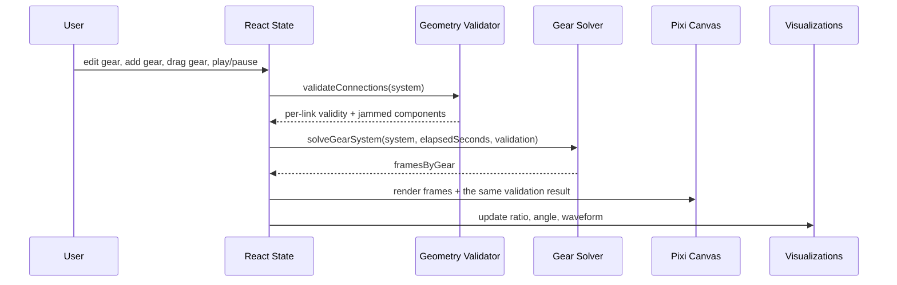
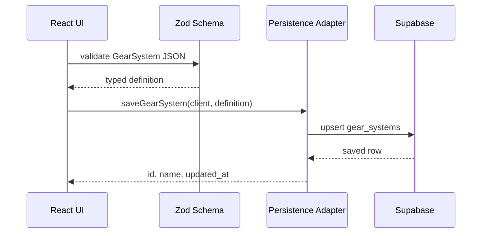

# System Map

This app is a TypeScript-first, client-heavy simulator. The simulation engine is
deterministic and framework-agnostic; React owns user state and controls; PixiJS
renders the gear field; Supabase stores authenticated gear systems.

## App Architecture

## Domain Model

`GearSystem.base` is fixed at `60` in v1 (the schema declares it as a literal);
it drives the base-60 degree-minute-second angle readouts.

`teeth` and `module` are the canonical pitch-size fields. Pitch radius is
derived as `module * teeth / 2`, and mesh speed ratio is derived from endpoint
tooth counts. Neither value is serialized redundantly. `phaseOffset` remains a
stored mounting relationship because it depends on connection geometry.

## Simulation Loop

React memoizes validation by `GearSystem`. Invalid links and jammed components
cannot transmit motion, while disconnected unreachable gears resolve to zero
RPM at their base angle. `angleDegrees` remains the logical lesson/readout
angle; `toothAngleDegrees` is the phase-aligned Pixi tooth-mark orientation.

Dragging translates the full transitive compound component. Drop finalization
may snap that group to one existing, module-compatible mesh and then refreshes
phase offsets for every valid incident mesh. Validation itself is derived data:
it is not persisted and does not change timestamps or editor dirty state.

## Persistence Flow

The nested gear and connection schemas are strict. Persisted definitions with
legacy derived `radius` or `ratio` keys are rejected; no compatibility layer is
needed before saved production systems exist.

## Design Rules

- Keep simulator math deterministic and testable outside React.
- Treat this model as external spur-gear pitch geometry in canvas units, not a
  manufacturability, collision, torque, or force simulation.
- Keep browser code TypeScript-only.
- Do not add a Python backend for v1.
- Use Supabase publishable keys in the browser; never expose service role keys.
- Keep real math/physics labels separate from metaphor or speculative framing.
