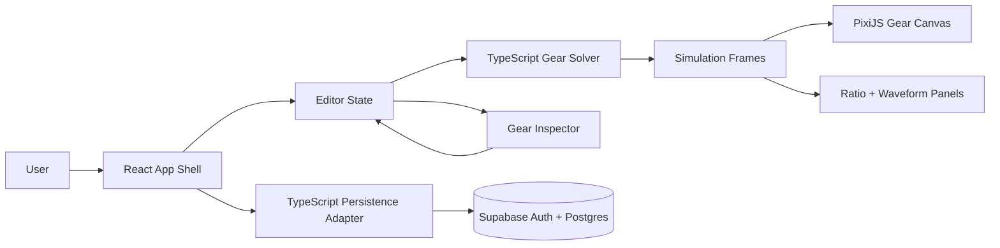
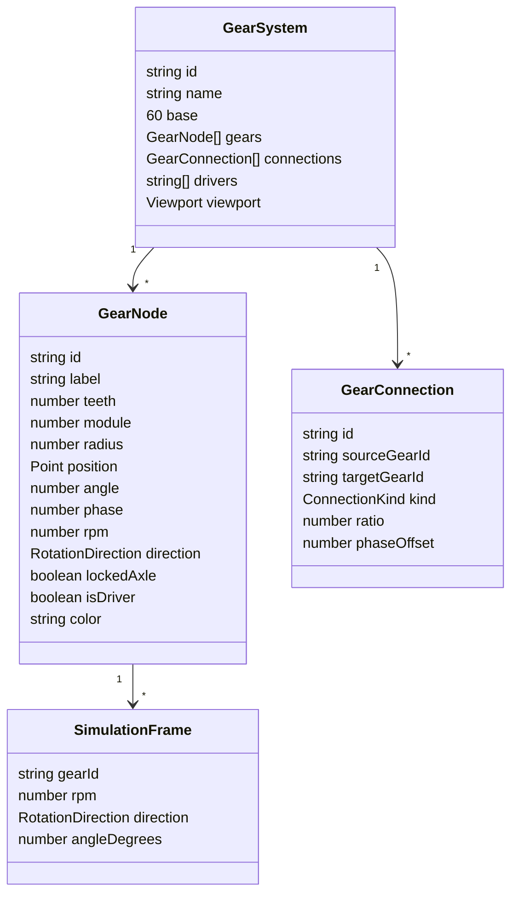
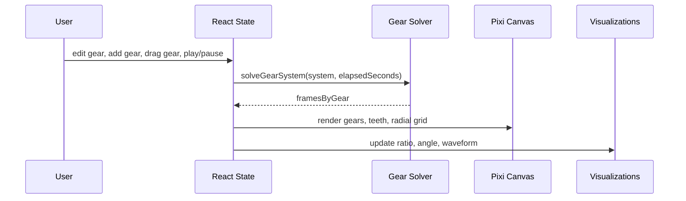
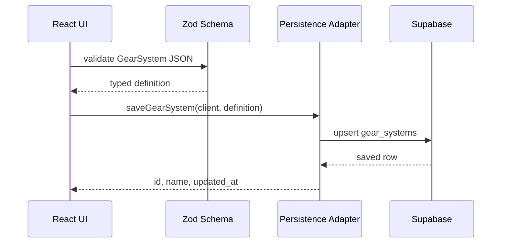

# System Map

This app is a TypeScript-first, client-heavy simulator. The simulation engine is
deterministic and framework-agnostic; React owns user state and controls; PixiJS
renders the gear field; Supabase stores authenticated gear systems.

## App Architecture

## Domain Model

## Simulation Loop

## Persistence Flow

## Design Rules

- Keep simulator math deterministic and testable outside React.
- Keep browser code TypeScript-only.
- Do not add a Python backend for v1.
- Use Supabase publishable keys in the browser; never expose service role keys.
- Keep real math/physics labels separate from metaphor or speculative framing.
